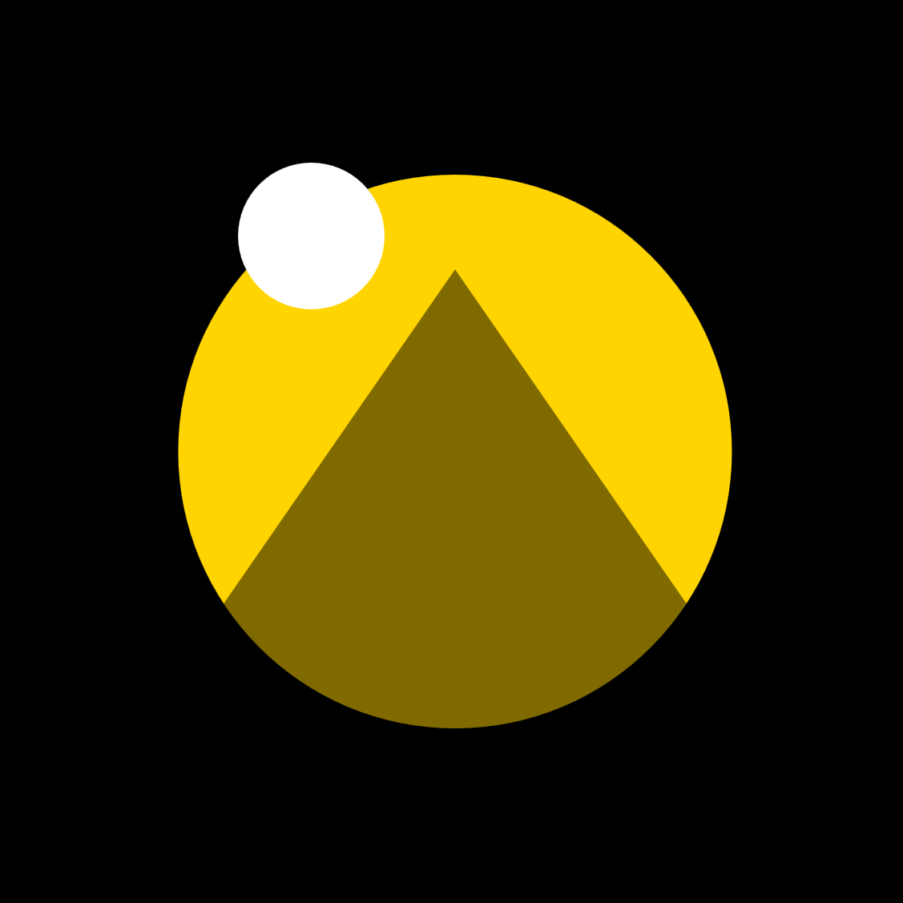
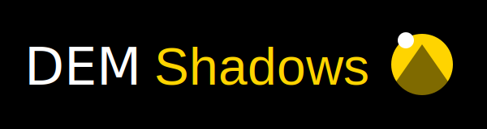

<p style="text-align:center;">
  
</p>

# DEM-Shadows — Visualizing Terrain Shadows & Sunlight

**Short summary:**  
DEM-Shadows is a lightweight tool for generating terrain shadow rasters, beautiful shadow animations, and cumulative sunlight maps from any DEM. It’s built to be simple, reproducible, and fun to explore — whether you want to study how light moves across mountains or just enjoy watching terrain breathe with the sun.

Installable from PyPI → https://pypi.org/project/dem-shadows/  
Streamlit demo + Colab notebook available below.

---

## 🌄 What DEM-Shadows Creates

### Per-Timestamp Shadows  
Instant snapshots of terrain lighting at a specific time:


---

## Base Terrain & Visual Context

To understand shadows, it helps to compare the underlying terrain and an orthophoto.  
Here are both, shown side by side:

<div style="display: flex; gap: 12px; justify-content: center; flex-wrap: wrap;">
  <div style="flex: 1; min-width: 240px;">
    <strong>DEM Hillshade</strong><br>
    
  </div>
  <div style="flex: 1; min-width: 240px;">
    <strong>Orthophoto</strong><br>
    
  </div>
</div>

---

## Shadow Animation

One of the most striking outputs: a full-day shadow animation.  
This one shows Zürich on **8 March 2025**:


---

## Cumulative Sunlight Map

How many hours does each pixel stay sunlit?  
DEM-Shadows computes a single cumulative sunlight raster:


This makes it easy to see sunlight patterns across valleys, slopes, and entire mountain regions.

---

## 🚀 Try It Yourself — No Installation Needed

### 🎛 Live Streamlit App  
Upload a DEM and generate shadows directly from your browser:

**https://dem-shadows.streamlit.app/**

---

### 📓 Google Colab Notebook  
Run the tool interactively in the cloud, no setup required:

**https://colab.research.google.com/github/marcop11/dem-shadows/blob/main/notebooks/try_it_yourself.ipynb**

---

## 🔧 Installation (Simple)

Install from PyPI:

```bash
pip install dem-shadows
```

---

## 🏁 Project Logo

<p style="text-align:center;">
  
</p>

---

DEM-Shadows grew out of my love for terrain, sunlight, mountains, maps, and geospatial analysis.  
If you try it on your favourite landscapes, I’d love to see what you discover.