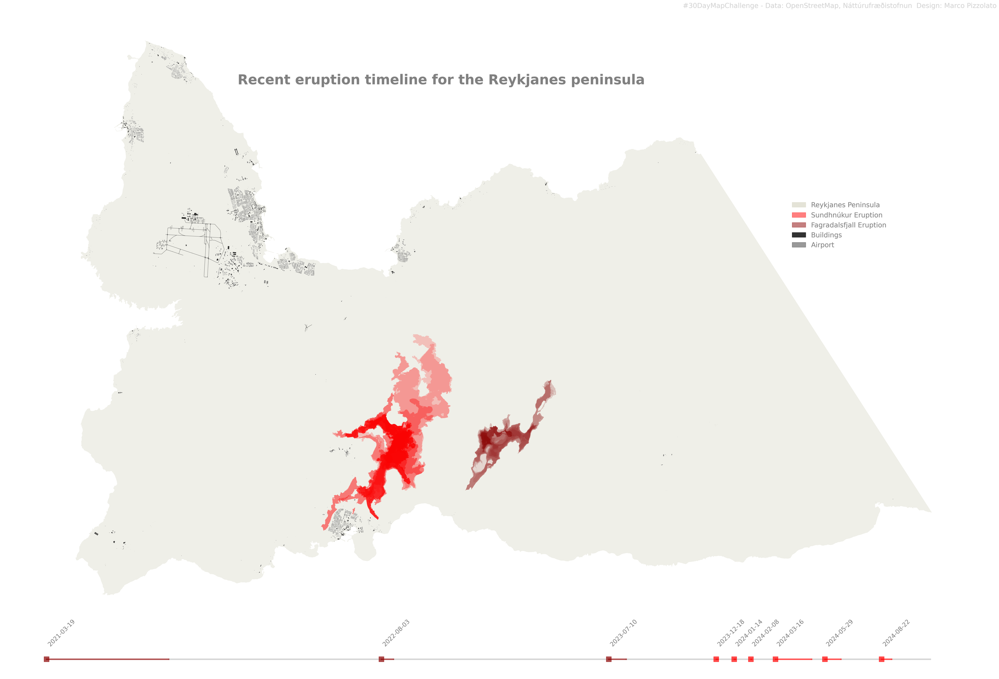

# Mapping Eruptions on Reykjanes — Visualizing Lava Polygons

This post is part of the **#30DayMapChallenge 2024**, created for **Náttúrufræðistofnun Íslands** (Icelandic Institute of Natural History).  
It showcases how simple polygon mapping can reveal the spatial extent of recent eruptions on the Reykjanes peninsula.

📍 **Project link:** https://github.com/natturufraedistofnun/30DayMapChallenge/tree/master/Day-3

---

## 🌋 Overview

This map visualizes the **eruption footprint polygons** from the **Fagradalsfjall** and **Sundhnúkar** volcanic systems on the Reykjanes peninsula, Iceland.

The polygons are overlaid on **OpenStreetMap** data to help contextualize the eruptions relative to:

- Buildings  
- Infrastructure  
- Nearby settlements  

This gives a clear sense of scale — how large the lava fields are, and how the eruptions intersect with human-made features.

The work was prepared for **Náttúrufræðistofnun Íslands**, contributing to ongoing efforts to document, visualize, and communicate Iceland’s active volcanic systems.

---

## 🗺 Why Polygons?

Volcanic eruptions produce rapidly evolving surfaces. Mapping these as polygons:

- Provides an intuitive overview of the eruption footprint  
- Makes it easy to compare different eruptive events  
- Helps communicate spatial scale to the public and decision makers  
- Forms the basis for hazard assessments, planning, and long-term monitoring  

Using polygons is also an excellent entry point for **beginner-friendly mapping in Python**, allowing readers to explore GIS workflows with real scientific data.

---

## 🧭 Interactive Tools to Try the Workflow

You can open the notebook and run the mapping code directly in the cloud:

| Run this code via free cloud platforms: |  |  |  |
|---|---|---|---|

These platforms require **no installation** — perfect for exploring the notebook or modifying the code to make your own eruption maps.

---

## 📚 Attribution

- **Created for:** Náttúrufræðistofnun  
- **Author:** Marco Pizzolato  
- **License:** CC BY 4.0  
- **Challenge:** [#30DayMapChallenge 2024](https://30daymapchallenge.com/)

---

If you'd like a version that includes more geological context, a volcano timeline, or comparison maps, just let me know!
